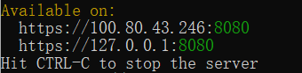

# 手写数字识别

本项目分为3个部分，分别是使用tensorflow、pytorch实现的手写数字识别，以及在线识别手写数字的网页应用。  

## 在线手写数字识别网页应用

通过Google Teachable Machine用MNIST数据集进行训练，导出得到的模型和前端Javascript代码，在本地启用https服务即可开始运行，能够相对准确地识别用鼠标书写在屏幕画布上的内容。

### 实现过程

上传训练集图片  

调整训练参数（高级）  

导出并下载模型（有多种类型可选，这里选用了网页端的js版本）  

在本地启用https服务  
`
http-server -S -C cert.pem -o
`

访问本机网络地址即可运行应用  

前端界面如图所示，按预测概率从高到低的顺序显示识别出的可能的数字  

## 在本地实现基于深度学习的手写数字识别

digit_recognition.ipynb基于tenserflow实现，digit_recognition2.ipynb基于pytorch实现。运行结果见下：  

  
程序所需的依赖库已在requirements.txt中给出  
